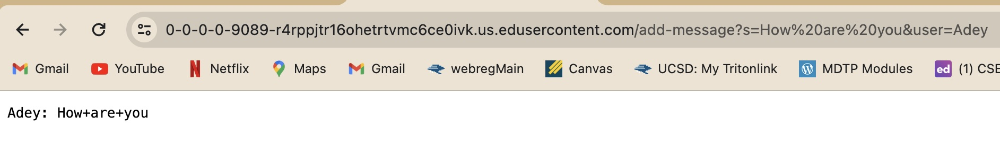
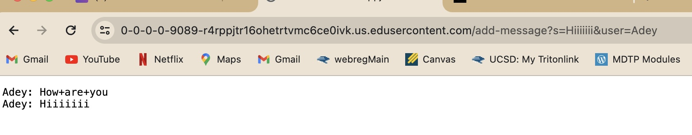

# Part 1

```
import java.io.IOException;
import java.net.URI;

class Handler implements URLHandler {
    StringBuilder chatMessages = new StringBuilder();

    public String handleRequest(URI url) {
        if (url.getPath().equals("/add-message")) {
            String queryString = url.getQuery();
            if (queryString != null) {
                String[] chatInfo = queryString.split("&");
                String message = null;
                String user = null;

                for (String info : chatInfo) {
                    String[] keyValue = info.split("=");
                    if (keyValue.length == 2) {
                        if (keyValue[0].equals("s")) {
                            message = keyValue[1];
                        } else if (keyValue[0].equals("user")) {
                            user = keyValue[1];
                        }
                    }
                }

                if (message != null && user != null) {
                    String chatMessage = String.format("%s: %s\n", user, message);
                    chatMessages.append(chatMessage);
                    return chatMessages.toString();
                } else {
                    return "Invalid input for /add-message!";
                }
            } else {
                return "Missing input for /add-message!";
            }
        } else {
           
            return chatMessages.toString();
        }
    }
}

class ChatServer {
    public static void main(String[] args) throws IOException {
        if(args.length == 0){
            System.out.println("Missing port number! Try any number between 1024 to 49151");
            return;
        }

        int port = Integer.parseInt(args[0]);
        Server.start(port, new Handler());
    }
}
```


# Which methods in your code are called?

The methods called in my code are the main method and the handleRequest method.


# What are the relevant arguments to those methods, and the values of any relevant fields of the class?

In the handleRequest method the argument given is a `URI url` which allows us to access the url that we inputted which was `https://0-0-0-0-9089-r4rppjtr16ohetrtvmc6ce0ivk.us.edusercontent.com/add-message?s=How are you&user=Adey`.
The values in this method include:
1.String Builder `chatMessages`
2.String `queryString = "s=How are you&user=Adey"`
3.String array `chatInfo = ["s=How are you", "user=Adey"]`
4.String `message = "How are you"`
5.String `user = "Adey"`
6.String array `keyValue = ["`
7.String `chatMessage = "Adey: How are you"`

In the main method it takes in a command line argument which was java ChatServer 9089 which is how the server was started.


# How do the values of any relevant fields of the class change from this specific request? If no values got changed, explain why.




# Which methods in your code are called?

The methods called in my code are the main method and the handleRequest method.


# What are the relevant arguments to those methods, and the values of any relevant fields of the class?

In the handleRequest method the argument given is a `URI url` which allows us to access the url that we inputted which was `https://0-0-0-0-9089-r4rppjtr16ohetrtvmc6ce0ivk.us.edusercontent.com/add-message?s=How are you&user=Adey`.
The values in this method include:
1.String Builder `chatMessages`
2.String `queryString = "s=How are you&user=Adey"`
3.String array `chatInfo = ["s=How are you", "user=Adey"]`
4.String `message = "How are you"`
5.String `user = "Adey"`
6.String array `keyValue = ["`
7.String `chatMessage = "Adey: How are you"`


In the main method it takes in a command line argument which was java ChatServer 9089 which is how the server was started.

# How do the values of any relevant fields of the class change from this specific request? If no values got changed, explain why.


# Part 2


