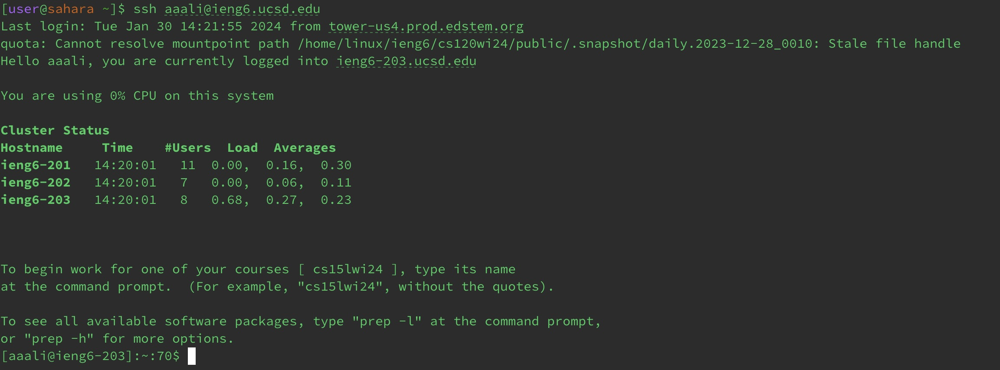

# Part 1

```
import java.io.IOException;
import java.net.URI;

class Handler implements URLHandler {
    StringBuilder chatMessages = new StringBuilder();

    public String handleRequest(URI url) {
        if (url.getPath().equals("/add-message")) {
            String queryString = url.getQuery();
            if (queryString != null) {
                String[] chatInfo = queryString.split("&");
                String message = null;
                String user = null;

                for (String info : chatInfo) {
                    String[] keyValue = info.split("=");
                    if (keyValue.length == 2) {
                        if (keyValue[0].equals("s")) {
                            message = keyValue[1];
                        } else if (keyValue[0].equals("user")) {
                            user = keyValue[1];
                        }
                    }
                }

                if (message != null && user != null) {
                    String chatMessage = String.format("%s: %s\n", user, message);
                    chatMessages.append(chatMessage);
                    return chatMessages.toString();
                } else {
                    return "Invalid input for /add-message!";
                }
            } else {
                return "Missing input for /add-message!";
            }
        } else {
           
            return chatMessages.toString();
        }
    }
}

class ChatServer {
    public static void main(String[] args) throws IOException {
        if(args.length == 0){
            System.out.println("Missing port number! Try any number between 1024 to 49151");
            return;
        }

        int port = Integer.parseInt(args[0]);
        Server.start(port, new Handler());
    }
}
```


# Which methods in your code are called?

The methods called in my code are the main method and the handleRequest method. We also have the class Handler which implements the URLHandler. The variables in the code are chatMessages, queryString, chatInfo, message, user, info, and keyValue.


# What are the relevant arguments to those methods, and the values of any relevant fields of the class?

In the handleRequest method, the argument given is a `URI url` which allows us to access the URL that we inputted.
Relevant field of the class is StringBuilder `chatMessages` which stores all of the chat messages added.
The values in this method include:
1.StringBuilder chatMessages = ""
2.String queryString = "s=How are you&user=Adey"
3.String array chatInfo = ["s=How are you", "user=Adey"]
4.String message = "How are you"
5.String user = "Adey"
6.String chatMessage = "Adey: How are you"

In the main method, it takes in a command line argument which was java ChatServer 9089 which is how the server was started.


# How do the values of any relevant fields of the class change from this specific request? If no values got changed, explain why.

The field chatMessages changes whenever the if statement checks whether the URL path contains `/add-message` is true and when `user` and `message are not null,
because then a new chat is added to chatMessages so the field is changed.  The other values mentioned in the second question also change according to whatever was inputted is the user string and message string.


# Which methods in your code are called?

The methods called in my code are the main method and the handleRequest method.


# What are the relevant arguments to those methods, and the values of any relevant fields of the class?

In the handleRequest method, the argument given is a `URI url` which allows us to access the URL that we inputted.
Relevant field of the class is StringBuilder `chatMessages` which stores all of the chat messages added. 

The values in this method include:
1.StringBuilder chatMessages = "Adey: How are you"
2.String queryString = "s=Hiiiiiii&user=Adey"
3.String array chatInfo = ["s=Hiiiiiii", "user=Adey"]
4.String message = "Hiiiiiii"
5.String user = "Adey"
6.String chatMessage = "Adey: Hiiiiiii"


In the main method, it takes in a command line argument which was java ChatServer 9089 which is how the server was started.

# How do the values of any relevant fields of the class change from this specific request? If no values got changed, explain why.

The field chatMessages changes whenever the if statement checks whether the URL path contains `/add-message` is true and when `user` and `message are not null,
because then a new chat is added to chatMessages so the field is changed. The other values mentioned in the second question also change according to whatever was inputted is the user string and message string.


# Part 2




# Part 3

Something that I learned from lab in weeks 2 and 3 that I didn't know before was how to start a server. I also learned how to set up ssh keys and access like our specific ieng6 thing. I also learned how manipulating a URL's path can allow you to execute different things like adding elements to a list. 
